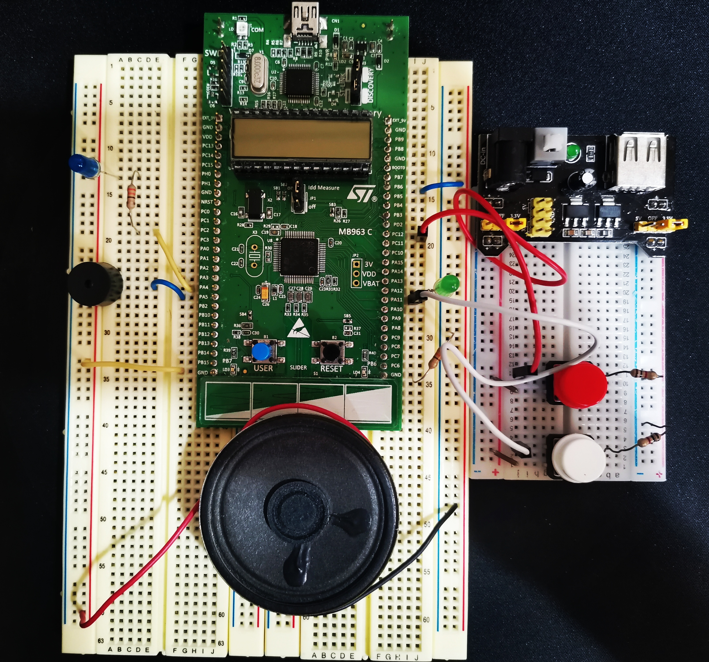
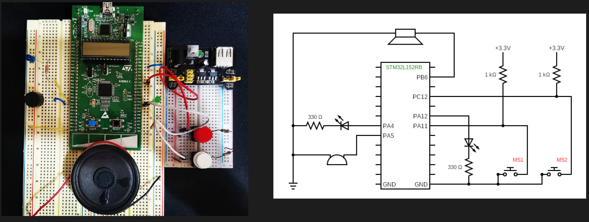
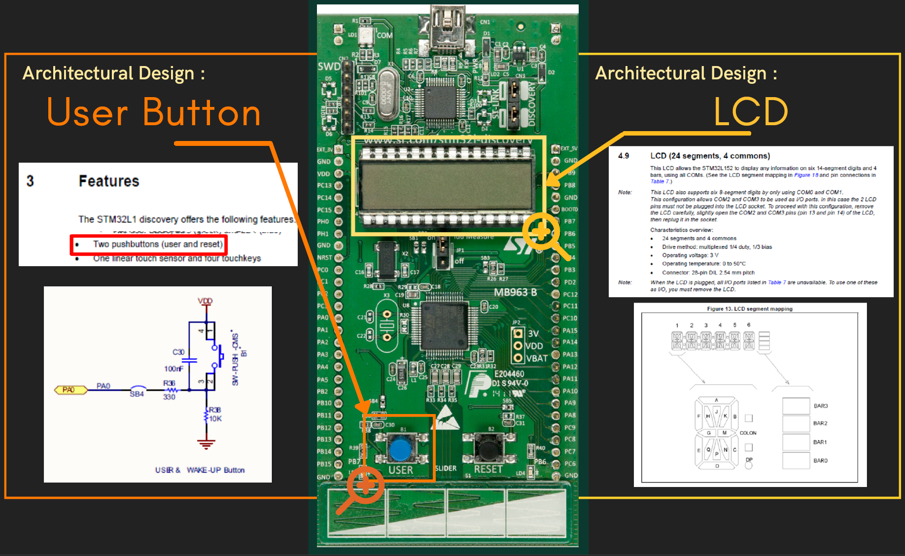
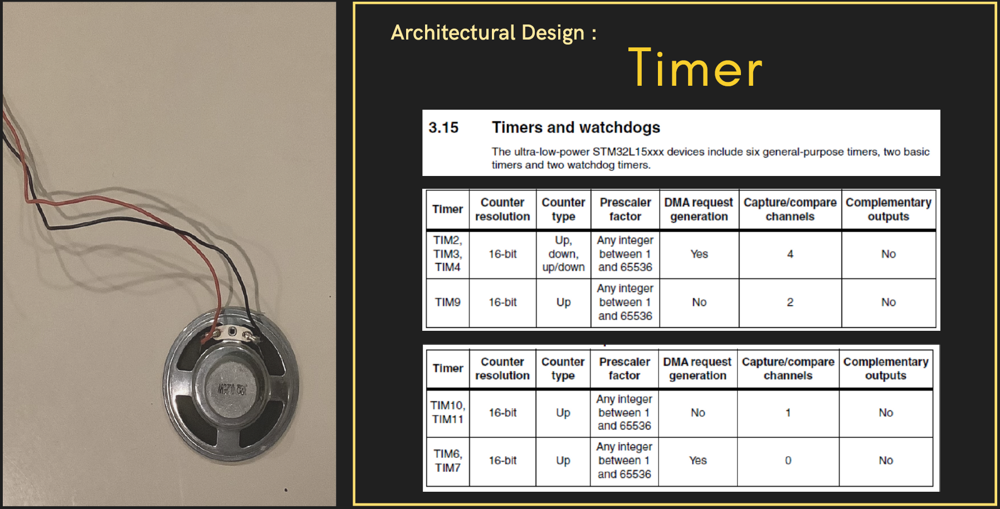
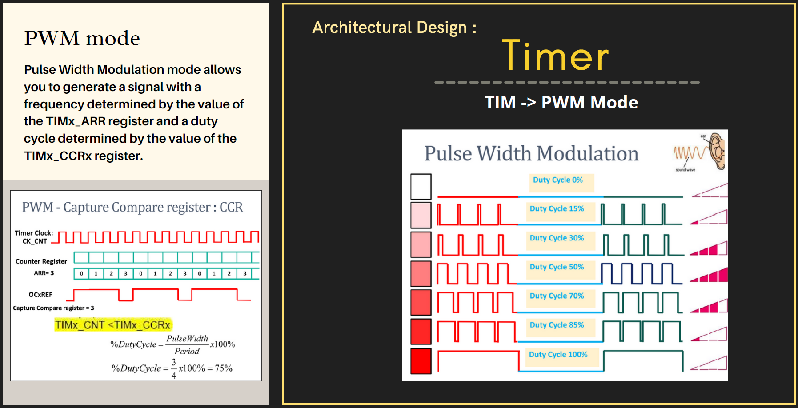
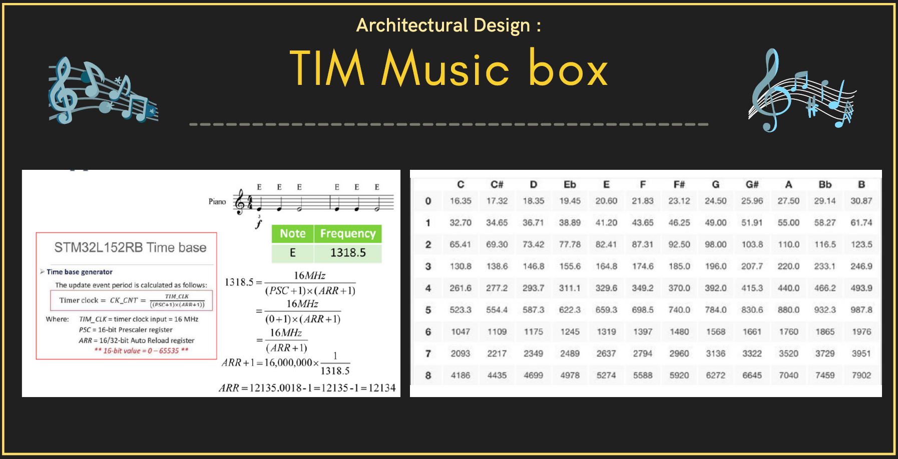
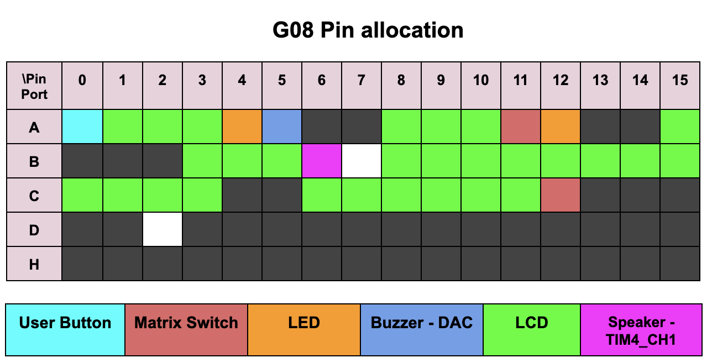

# CPE-312 Count 24 Game Project

Thai-Nichi Institute of Technology (泰日工業大学)  
CPE-312: Embedded System: Semester 2/2021  
Section 1 Group 8

<p align="center">

</p>

## Overview

### Count 24

The game progresses by counting up from 1 to 24, with the player who calls "24" become a loser in that round.

### Decide numbers decode to LCD colors

- `no color` : 1
- `green` : 2
- `blue` : 3
- `green & blue` : random number

### Music box

The game will play music. When the player wins.

## Requirements

- Keil uVision5
- Microprocessor: STM32L152RB
- Power Supply
- Speaker
- Buzzer
- Switch x2
- LED (green & blue) x2
- 330 Ohm resistors x3

## Specifications

### System information

- `MCU` : STM32L152RB
- `LCD` : 6-digit, 24 segment
- `Push buttons` : user button
- `TIMER` : PWM Mode
- `Software` : Keil / Language CMCU : STM32L152RB

### Function

- Show game count number (LCD)
- Selected number (Matrix Switch)
- Confirm number (push button)
- Indicate Number status (LEDs)
- Music box (PWM Mode)

### Behavior

- Show game count number (LCD)
  - 6-digit EG: `xx-p-y`
  - `xx` : current total number
  - `p` : p-player, c-computer
  - `y` : selected number
- Selected number (Matrix Switch)
  - `00` -> 1, `01` -> 2 ,`10` -> 3 , `11`-> rand
- Confirm number (push button) : User button
- Indicate Number status (LEDs)
  - `None` -> 1 ,`Green` -> 2, `Blue` -> 3,`Green & Blue` -> rand
- Music box (PWM Mode)
  - `win` : play soundtrack
  - `lose` : buzzer

## Architectural design

### Inputs

- Push Button
- Matrix Switch

### Processes

- EXTI
- DAC
- TIM

### Outputs

- LED
- LCD
- Buzzer
- Speaker

### Hardware and circuit



### User Button & LCD



### Timer




### TIM Music box



### Board pin allocation



## 📦 Installation

### GUI

1. Click drop down `code` button on top of this repository.
2. Open with GitHub Desktop.
3. Clone this repository to your local drive
4. Open in Keil uVision5.

### CLI

```bash
$ git clone https://github.com/pichayakorn/S1-G08-2021.git
```

## 🛠️ Contributors

<a href="https://github.com/pichayakorn/stm-count-24-v2/graphs/contributors">
  
</a>

## 🛡️ License

The codes are licensed under the MIT license.

Check out [LICENSE](/LICENSE) for more detail.
